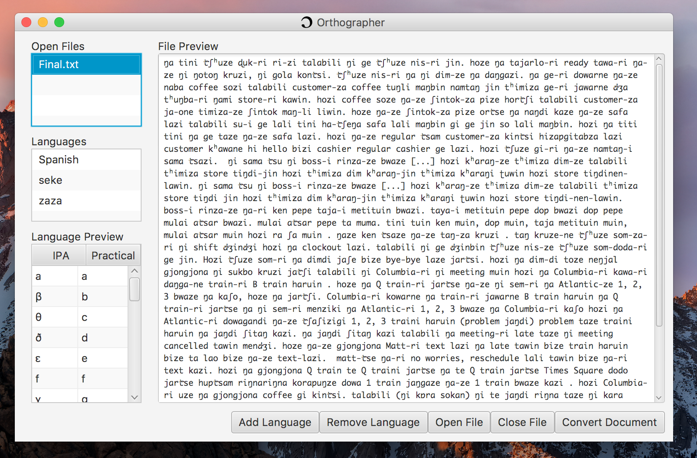
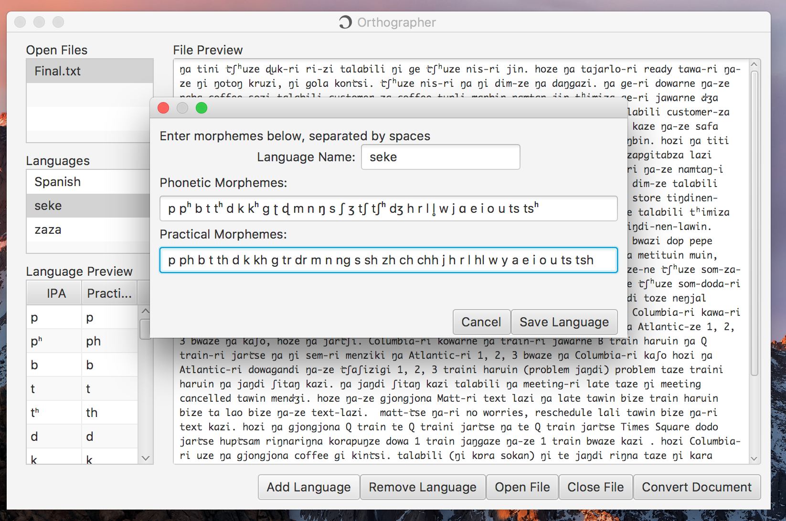
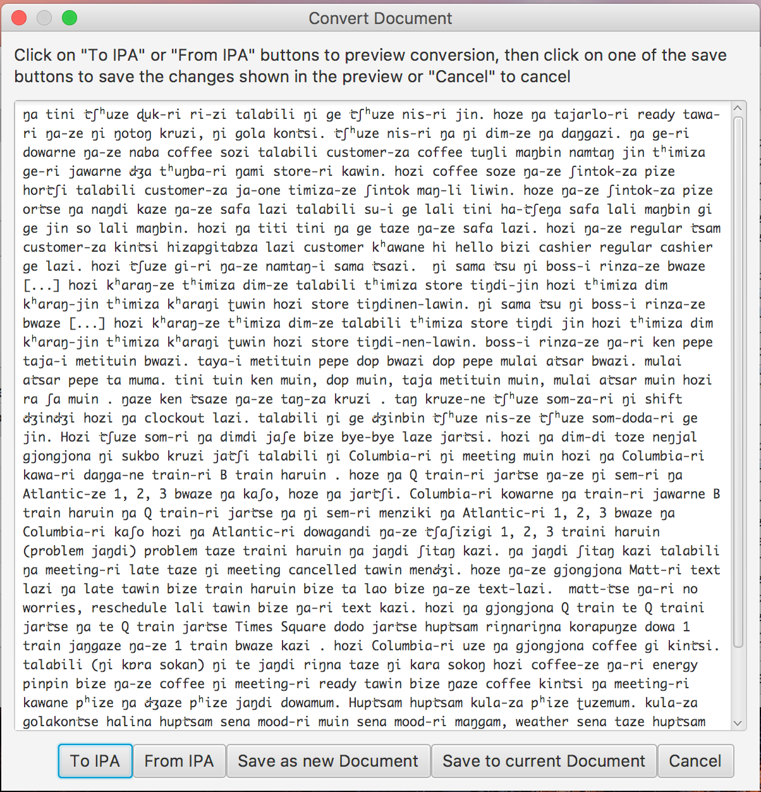

# Orthographer 
#### IPA to Practical Orthography Converter
Orthographer is a desktop application that takes text files (.txt) of any size and converts their contents between phonemic transcription in IPA and transcription in the relevant practical systems of writing, which typically make use of characters from the Roman alphabet. Download Othographer.zip from the distribution directory and try it out!

#### Sample
This sample uses Seke, a language spoken in northern Nepal and included in the Orthographer languages list by default. The conversion is from IPA to practical orthography. 
##### Input Text 
_ŋa tini t͡ʃʰuze ɖuk-ri ri-zi talabili ŋi ge t͡ʃuze nis-ri jin. hoze ŋa tajarlo-ri ready tawa-ri ŋa-ze ŋi ŋotoŋ kruzi, ŋi gola kont͡si. t͡ʃʰuze nis-ri ŋa ŋi dim-ze ŋa daŋgazi. ŋa ge-ri dowane ŋa-ze naba coffee sozi talabili customer-za coffee tuŋli maŋbin namtʰaŋ jin tʰimiza ge-ri jawarne d͡ʒa tʰuŋba-ri ŋami store-ri kʰawin._
##### Output
_nga tini chhuze druk ri ri zi talabili ngi ge chuze nis ri yin. hoze nga tayarlo ri ready tawa ri nga ze ngi ngotong kruzi, ngi gola kontsi. chhuze nis ri nga ngi dim ze nga danggazi. nga ge ri dowane nga ze naba coffee sozi talabili customer za coffee tungli mangbin namthang yin thimiza ge ri yawane ja thungba ri ngami store ri khawin._

#### Opening the Application
Note: Java must be downloaded for the program to run.
Compiled using Java SE-10.

To use Orthographer, open Orthographer.zip using any unarchiving software. This will create a folder called Orthographer. Open this folder and double click on Orthographer.jar, and the application will launch. 

#### Adding Languages
Orthographer can be used with any language, simply click on "Add Language", enter the language name and lists of morphemes in the appropriate fields in the new window, and save. 

#### Opening Files
To open a file, click on "Open File." The file name will appear on the top left. Clicking on a file name in the top left box will cause the contents of this file to be displayed in the main screen. 

#### Selecting Languages
To select the language the file is written in, click on the name of the language in box on the left side of the window. The morphemes in this language will show up in the table on the bottom left. 

#### Converting Files
To convert the document, click on "Convert Document" button on then bottom right. This process will use the currently selected language in the left side list of langauges. In the new window, a live preview of your selected document will display on the top. To preview how the document will appear after conversion, simply click on the button for the desired conversion. Clicking on "To IPA" will change all morphemes that match the practical morphemes listed in the language to their International Phonetic Alphabet equivalents. Clicking on "From IPA" will change all morphemes that match the IPA morphemes listed in the language to their practical orthography equivalents. Clicking on either will change the text in the file content preview, and will select your desired conversion. 

#### Saving the Results
To save the text displayed in the preview, click on either "Save to current Document," which will overwrite the original content of the document with the content shown in the preview, or click on "Save as new Document," which will save the text in the preview as a new .txt file.
